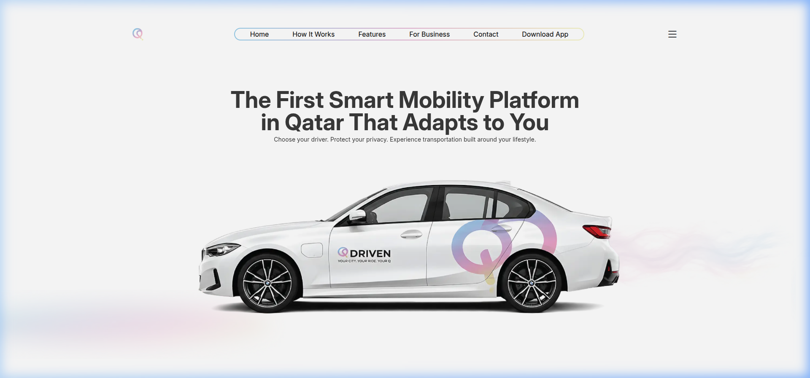
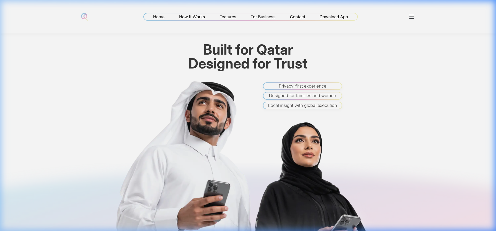
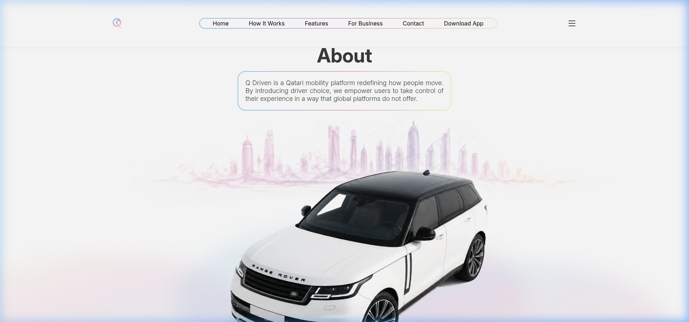
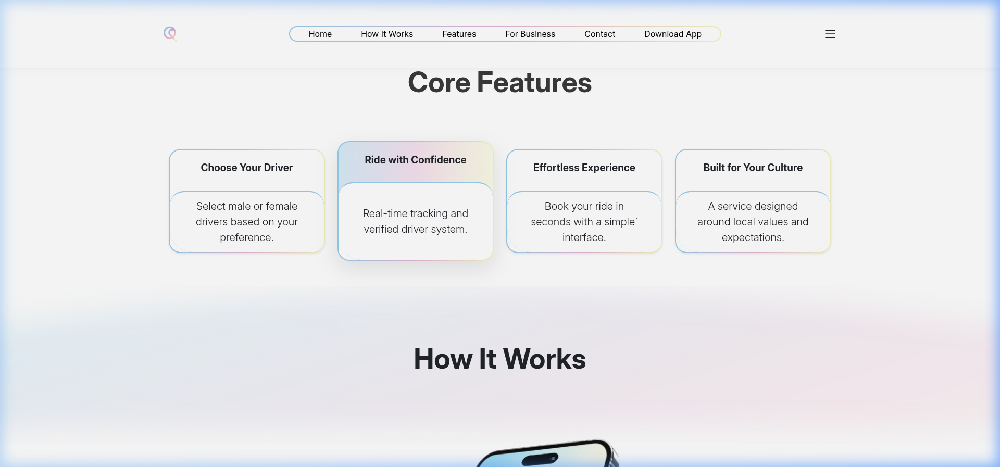
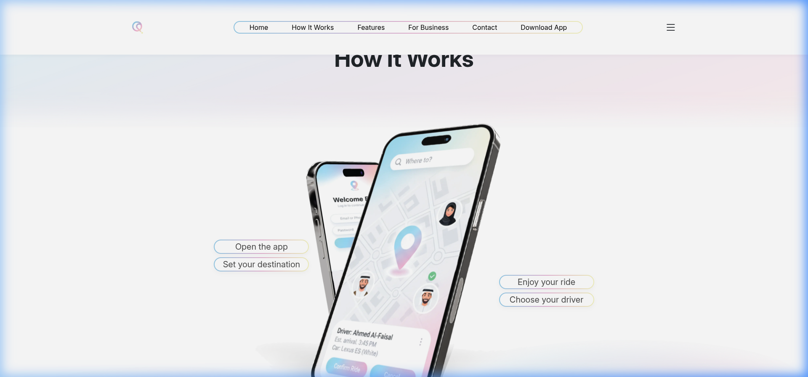

# 🚗 Q Driven — Smart Mobility Platform Landing Page

> **The First Smart Mobility Platform in Qatar That Adapts to You**

🔗 **Live Demo:** [https://dynamic-axolotl-48ecb1.netlify.app/](https://dynamic-axolotl-48ecb1.netlify.app/)

---

## 📖 About The Project

**Q Driven** is a landing page for a Qatari mobility platform that redefines how people move. The platform introduces **driver choice** — allowing users to select male or female drivers based on their preference — empowering users to take control of their transportation experience in a way that global platforms do not offer.

The website is designed with a **modern, clean, and premium** aesthetic, targeting the Qatari market with culturally-aware features emphasizing **privacy, comfort, and reliability**.

---

## ✨ Key Features

| Feature                      | Description                                                            |
| ---------------------------- | ---------------------------------------------------------------------- |
| 🎨 **Premium Design**        | Clean white layout with pastel gradient accents (pink/purple/yellow)   |
| 📱 **Fully Responsive**      | Optimized for desktop, tablet, and mobile using Bootstrap 5 grid       |
| 🎭 **Scroll Animations**     | AOS (Animate On Scroll) with randomized fade-up effects                |
| 🍔 **Off-Canvas Navigation** | Mobile hamburger menu with smooth slide-in from the right              |
| 🔗 **Smooth Scrolling**      | jQuery-powered smooth scroll to sections with active link highlighting |
| ⏳ **Loading Overlay**       | Animated progress bar with fade-out transition on page load            |
| 🧭 **Sticky Navbar**         | Shrinks with shadow on scroll for better UX                            |
| 🔤 **Custom Fonts**          | Inter & Montserrat loaded locally for brand consistency                |
| 🏷️ **SEO Optimized**         | Full Open Graph, Twitter Cards, meta description, and semantic HTML    |

---

## 🛠️ Tech Stack

| Technology                 | Purpose                                               |
| -------------------------- | ----------------------------------------------------- |
| **HTML5**                  | Semantic page structure                               |
| **CSS3**                   | Custom styling with CSS variables, clamp(), gradients |
| **Bootstrap 5.3.3**        | Responsive grid, offcanvas, utilities                 |
| **Bootstrap Icons 1.11.3** | Icon library for UI elements                          |
| **jQuery 3.7.1**           | DOM manipulation, smooth scroll, navbar shrink        |
| **AOS 2.3.1**              | Animate On Scroll library                             |
| **Netlify**                | Hosting & deployment                                  |

---

## 📁 Project Structure

```
Drine/
├── index.html                          # Main HTML page
├── README.md                           # Project documentation
│
├── frontend/
│   ├── css/
│   │   └── style.css                   # Custom styles (371 lines)
│   ├── Fonts/
│   │   ├── Inter-VariableFont_opsz,wght.ttf
│   │   └── Montserrat-Regular.ttf
│   └── images/
│       ├── logo.webp                   # Navbar logo
│       ├── logo.ico                    # Browser favicon
│       ├── logo-footer.webp            # Footer logo
│       ├── og_logo.png                 # Open Graph image
│       ├── header.webp                 # Hero section car image
│       ├── Qatar.webp                  # "Built for Qatar" section image
│       ├── about.webp                  # About section (Doha skyline)
│       ├── image.webp                  # "How It Works" phones mockup
│       ├── Control-sky.webp            # CTA title background
│       ├── Call-sky.webp               # Sky background asset
│       ├── right-sky.webp              # Decorative sky element
│       └── skyfooter.webp              # Footer sky decoration
│
└── js/
    ├── 1-aos-random-animations.js      # Auto-applies AOS to all page elements
    ├── 2-handleScrollTo.js             # Smooth scroll navigation handler
    ├── script.js                       # Main app initialization
    └── script/
        ├── 1-navbar-shrink.js          # Navbar shrink on scroll
        └── 4-loading-overlay.js        # Loading screen with progress bar
```

---

## 🗂️ Page Sections

### 1. 🏠 Hero / Header (`#home`)



- Bold headline: _"The First Smart Mobility Platform in Qatar That Adapts to You"_
- Tagline about privacy and driver choice
- Hero image of a branded BMW
- "Download Now" CTA button + "Request Early Access" text

### 2. 🇶🇦 Built for Qatar



- Large typography section with trust messaging
- Floating gradient badges:
  - _Privacy-first experience_
  - _Designed for families and women_
  - _Local insight with global execution_
- Background image of Qatari models using phones

### 3. 📄 About (`#for-business`)



- Brief platform description in a gradient-bordered card
- Full-width Doha skyline illustration

### 4. ⭐ Core Features (`#features`)



- 4-column card grid layout with gradient borders:
  - **Choose Your Driver** — Select male or female drivers
  - **Ride with Confidence** — Real-time tracking & verified drivers
  - **Effortless Experience** — Quick booking interface
  - **Built for Your Culture** — Respects local values
- Active card with elevated shadow and gradient header

### 5. 📲 How It Works (`#how-it-works`)



- Visual step-by-step guide with phone mockups
- Floating badges showing the flow:
  - Open the app → Set your destination → Choose your driver → Enjoy your ride

### 6. 📥 Call To Action (`#download`)

- Down-arrow circle icon
- "Take Control of Your Ride Today" text with sky background
- Large "Download Q Driven Now" button

### 7. 📬 Footer (`#contact`)


- Footer logo + social media icons (YouTube, TikTok, X, Instagram, Facebook)
- Navigation links
- Contact info: `info@qdrivenapp.com` | `+974 3167 7773` | Doha, Qatar
- Email newsletter subscription input
- Decorative sky image

---

## 🎨 Design System

### Color Palette

| Color                             | Usage                       |
| --------------------------------- | --------------------------- |
| `#3a3a3a`                         | Primary text color          |
| `#fff` / White                    | Background                  |
| `#96cdea` → `#e6b4d4` → `#f4f4c0` | Gradient borders & accents  |
| `#5a5a5a`                         | Secondary text / icon color |
| `#000`                            | Footer social icon hover    |

### Typography

| Font                 | Usage                       |
| -------------------- | --------------------------- |
| **Inter** (Variable) | Body text, paragraphs       |
| **Montserrat**       | Headings (`f-family` class) |

### Responsive Breakpoints

| Breakpoint | Behavior                                     |
| ---------- | -------------------------------------------- |
| `> 992px`  | Full desktop layout with inline nav          |
| `≤ 992px`  | Offcanvas mobile menu, adjusted card shadows |
| `≤ 768px`  | Badge repositioning                          |
| `≤ 550px`  | Smaller cards (150px), reduced badge text    |

---

## 🚀 Getting Started

### Prerequisites

No build tools are required — this is a static HTML/CSS/JS site.

### Run Locally

1. Clone the repository:

   ```bash
   git clone <repository-url>
   cd Drine
   ```

2. Open `index.html` in your browser, or use a local server:

   ```bash
   # Using Python
   python3 -m http.server 8000

   # Using Node.js
   npx serve .
   ```

3. Visit `http://localhost:8000` in your browser.

### Deploy

The project is deployed on **Netlify**. To deploy your own version:

1. Push the repo to GitHub
2. Connect the repo to [Netlify](https://www.netlify.com/)
3. Set **publish directory** to `/` (root)
4. Deploy! 🎉

---

## 📜 JavaScript Modules

| File                         | Description                                                                                                                                                                     |
| ---------------------------- | ------------------------------------------------------------------------------------------------------------------------------------------------------------------------------- |
| `script.js`                  | Main entry point — initializes all modules via `window.App` namespace                                                                                                           |
| `1-aos-random-animations.js` | Auto-applies `fade-up` AOS animations to all visible content elements, with smart exclusion of nav/footer elements and temporary `overflow: hidden` on parents during animation |
| `2-handleScrollTo.js`        | Handles smooth scroll navigation for `.scroll-to` links with navbar height offset                                                                                               |
| `1-navbar-shrink.js`         | Adds `navbar-shrink` class with shadow on scroll (`> 50px`)                                                                                                                     |
| `4-loading-overlay.js`       | Controls loading screen lifecycle: progress bar animation → AOS init → overlay fade-out                                                                                         |

---

## 📧 Contact

- **Email:** [info@qdrivenapp.com](mailto:info@qdrivenapp.com)
- **Phone:** [+974 3167 7773](tel:+97431677773)
- **Location:** Doha, Qatar

---

<p align="center">
  Made with ❤️ for Qatar
</p>
# q_drive-public
